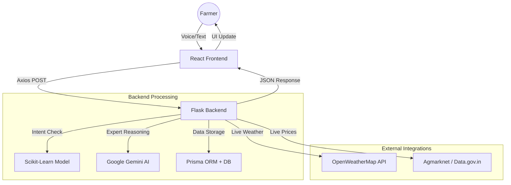

# 🌾 KisanAI — Next-Gen Agricultural Advisory System

An intelligent, AI-driven farming assistant that empowers Indian farmers with real-time advice on crops, pests, market prices, and weather conditions. 

KisanAI combines **Natural Language Processing (NLP)**, **Generative AI (Gemini)**, and **Real-time APIs** to provide a comprehensive digital toolkit for modern agriculture.


---

## 🏗️ System Architecture



---

## ✨ Key Features

| Feature | Technical Implementation |
|---|---|
| 💬 **AI Expert Chat** | Uses **Google Gemini Flash** for high-quality farming advice and **Scikit-Learn** for local intent classification. |
| 🌍 **Multilingual** | Supports English, Hindi, Punjabi, and Malayalam using a dedicated translation utility. |
| 🌦️ **Weather Intelligence** | Real-time weather alerts using OpenWeatherMap API with custom AI-generated farming tips. |
| 📊 **Live Market Prices** | Fetches live crop prices from **Data.gov.in** API with fallback mechanisms for offline stability. |
| 🌱 **Crop Recommender** | Intelligent recommendation engine based on Soil Type, Season, and Water availability. |
| 🔐 **Secure Auth** | User authentication managed via **JWT (JSON Web Tokens)** and **Bcrypt** password hashing. |
| 📱 **Responsive UI** | Built with **Tailwind CSS** and **Framer Motion** for a premium, app-like experience on mobile. |

---

## 🛠️ Technology Stack

### **Frontend**
- **React 18** (Vite)
- **Tailwind CSS** (Styling)
- **Framer Motion** (Animations)
- **Axios** (API Communication)
- **Web Speech API** (Voice-to-Text)

### **Backend**
- **Python / Flask** (API Server)
- **Google Generative AI SDK** (Gemini Integration)
- **Prisma Client Python** (Database ORM)
- **Scikit-Learn** (Intent Classification)
- **JWT & Bcrypt** (Security)

---

## 🚀 Getting Started

### 1. Backend Setup
```bash
cd backend
python -m venv venv
source venv/bin/activate  # venv\Scripts\activate on Windows
pip install -r requirements.txt
python app.py
```

### 2. Frontend Setup
```bash
cd frontend
npm install
npm run dev
```

---

## 📈 Future Enhancements (Viva Roadmap)

- **Plant Disease Detection:** Integrate a Convolutional Neural Network (CNN) to diagnose crops via uploaded photos.
- **Offline Mode:** Use Progressive Web App (PWA) features for low-connectivity regions.
- **Direct Market Access:** Connect farmers directly with buyers to eliminate middle-men.
- **IoT Integration:** Connect with soil moisture sensors for automated irrigation alerts.

---

## 📄 Academic Project Disclaimer
This project was developed as a **Capstone Project** for [Your University Name]. It demonstrates the integration of modern AI, Web Technologies, and Data Engineering to solve real-world agricultural problems.

**Built with ❤️ for Indian Farmers.**
